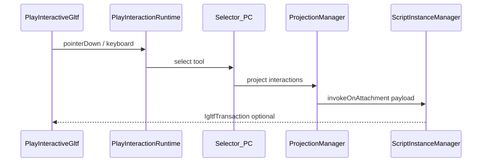

# Play interaction runtime (igltf-engine)

## Scope

- **In scope:** Event, Link, Form, Manipulation, Parameters, tool project/release, hover, PC input policy, WebXR API surface (left/right selectors).
- **Out of scope (v1):** Drawing, UMI3D Forge networking, camera/navigation changes.

## Architecture

## Portable request kinds

| Kind | Script method | Notes |
|------|---------------|-------|
| `eventTriggered` | `onEvent` | Click |
| `eventStateChanged` | `onEvent` | Hold start/end |
| `linkOpened` | `onLink` | URL in payload |
| `formAnswer` | `onForm` | Answers map |
| `manipulationRequest` | `onManipulation` | Translation + rotation |
| `parameterSetting` | `onParameter` | Parameter DTO snapshot |
| `toolProjected` / `toolReleased` | lifecycle hooks | Local callbacks |
| `hoverStateChanged` / `hovered` | lifecycle hooks | Raycast hover |

## UIs

| Module | UMI3D Browser reference |
|--------|-------------------------|
| `InteractableUi` | `InteractableUIVC` |
| `FormsUi` | `Assets/Runtime/UI/Forms` |
| `ContextualMenuUi` | `Assets/Runtime/UI/ContextualMenu` |

## WebXR

`WebXrInputLayer` exposes `LeftVR` / `RightVR` selectors aligned with UMI3D VR browser naming. Immersive session entry is optional (`tryEnterWebXr`); per-frame pose-driven hover is stubbed for later parity.

## Reference migration inventory

See [interaction-migration-inventory.md](./interaction-migration-inventory.md) for CDK/Browser C# sources mapped to JS modules.
